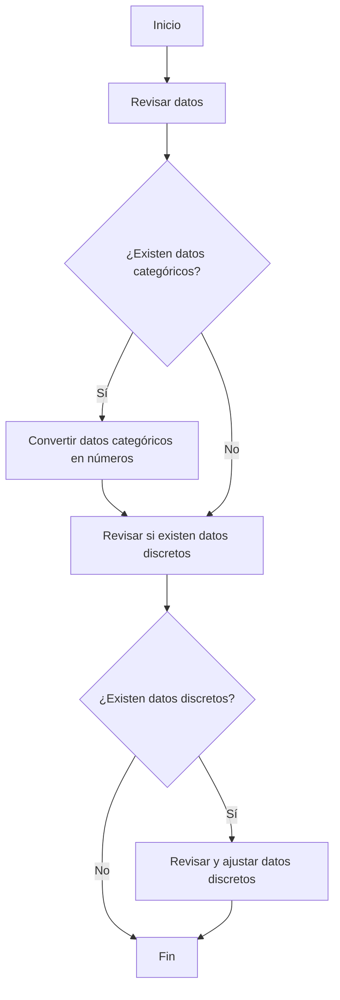

# 📊 Curso de Inmersión de Datos con Python - Alura Latam

Este repositorio contiene los proyectos y ejercicios realizados durante el curso de Inmersión de Datos con Python en Alura Latam.

## 📝 Descripción

En este curso, aprenderemos a preprocesar y explorar datos utilizando Python y librerías como Pandas, Numpy, y Matplotlib. El curso está dividido en varias clases donde cubrimos diferentes aspectos del análisis de datos.

## 📚 Clases

### 🧩 Clase 01: Preprocesamiento y Exploración de Datos
En esta clase, veremos cómo:

- Cargar datos en un DataFrame de Pandas.
- Inspeccionar y entender la estructura de los datos.
- Limpiar y preparar los datos para el análisis.
- Realizar análisis exploratorio de datos (EDA) para obtener información relevante.


### Clase 02: pendiente
En esta clase, veremos cómo:

- pendiente


## 🛠️ Requisitos

- Python 3.7 o superior
- Jupyter Notebook
- Pandas
- Numpy
- Matplotlib

## 🚀 Instalación

1. Clona este repositorio:
   ```bash
   git clone https://github.com/tu-usuario/inmersion-datos-python.git

# Diagrama de Flujo del Proceso de Datos



2. Contribuciones

Las contribuciones son bienvenidas. Si deseas contribuir, por favor sigue los siguientes pasos:

    Haz un fork del repositorio.
    Crea una nueva rama con tu contribución: git checkout -b mi-contribucion
    Realiza tus cambios y haz commit de los mismos: git commit -m 'Agregar mi contribución'
    Sube tus cambios a tu repositorio fork: git push origin mi-contribucion
    Crea un pull request en GitHub.

Licencia

Este proyecto está bajo la Licencia MIT. Consulta el archivo LICENSE para más detalles.
Contacto

Si tienes alguna pregunta o sugerencia, no dudes en contactarme a través de github
